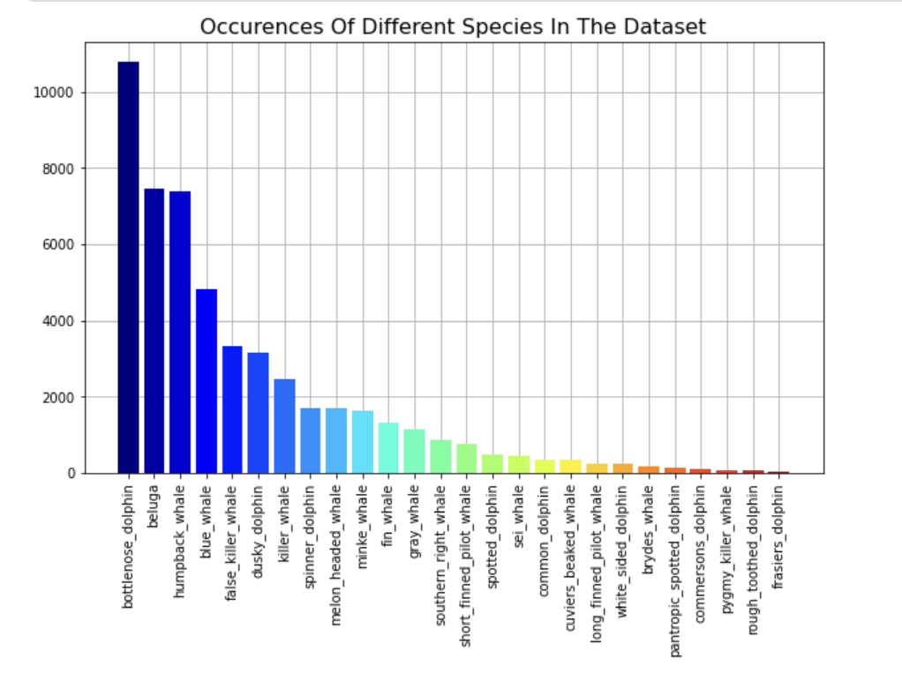

```{r setup, include=FALSE}
knitr::opts_chunk$set(echo = FALSE)

# Load dependencies 
#library(reticulate) # For rendering Python code 
```
 

```{r fig1, eval = TRUE, echo = FALSE, out.width = '100%', fig.cap = "Example photo-ID over time"}
knitr::include_graphics("figures/photo_ID_example.png")
```

Man-made climate change is one of the main challenges for humanity and of concern for many scientific disciplines investigating its multiple, complex impacts on nature and societies. One of the ecosystems impacted are marine ecosystems. Research concerning marine mammals makes an important contribution to our knowledge about changes in the oceans, as marine mammals are indicators of ocean ecosystem health. Therefore their protection and conservation is a crucial task. Up until today, most observation and tracking of individual animals and populations is done manually by humans - a time consuming and error- prone method. Motivated by a Kaggle competition funded by the research collaboration ”Happywhale”, we aim to contribute to the efforts by automating whale and dolphin photo-ID to significantly reduce image identification times. We investigated the use of conventional Machine Learning and a Deep Learning algorithm for this image classification task.As expected, we find that conventional machine learning classifiers under-perform in correctly distinguishing between subtle characteristics of the natural markings of whales and dolphins and therefore state-of-the-art deep learning models are needed for this complex task. 

## Background

For several years, the impacts of man-made climate change have been specifically visible through the alteration and destruction of the marine ecosystem. A worrying development is the change in the migratory behavior of whales, dolphins and sharks as it is a strong indicator for the destruction of the ecosystems they are living in. The protection and conservation of marine mammals is crucial to the balance and therefore the health of ecosystems. To be able to carry out meaningful conservation efforts, the first steps are understanding the status quo of different animal populations and their migration patterns by identification and monitoring of individual animals.

<aside>
The identification by natural markings, via photographs is known as **photo-ID**.
</aside>  

Currently, the majority of research institutions still rely on ressource-intensive and sometimes inaccurate manual matching of photographs by the human eye. This slow and imprecise practice naturally limits the scope and impact of existing research. The automatized Image Classification of whales and dolphins could enable a scale of study previously unaffordable or impossible. There are first attempts of using Machine Learning in marine biology and environmental protection to address this challenge. Most of the research either uses recordings of dolphin or whale sounds for classification [@huang2016automated] or photographs of fins [@hughes2017automated; @reno2020fins] given that these are the two most common types of documenting (sounds or images) wild animals.    
  
Current methods of these automated classification attempts are mostly Deep Learning (DL) approaches using convolutional neural networks (CNN). Regarding standard Machine Learning (ML) techniques, however, there is not much research to be found. This might be due to the challenging task of distinguishing between unique – but often very subtle – characteristics of the natural markings of whales and dolphins.  
  
In this article, we present a classical machine learning approach for automated photo-ID and test it against a the-state-of-the-art deep learning approach to see, if both approaches would be feasible. Our approaches focuses mainly on prediction precision and accuracy, and only secondary on prediction and training time, and is limited to images of dorsal fins and lateral body views.
We broke down the task into three main challenges:

1. Removing the animal from the rest of the picture using Image Segmentation, 
2. Using and testing ML classifiers for species classification and 
3. Implementing a DL model to extend the use case from the classification of species to individual animals.

The dataset was provided by the Kaggle competition initiator "Happywhale" and includes over 50.000 images of fins and lateral body views of dolphins and whales in different pixel sizes. To be able to focus on the models, we based our apporaches on a pre-cropped dataset provided by a fellow Kaggler. Based on the state-of-the-art deep learning methods for image segmentation we use *Tracer* to remove the background from the images. In a next step we established a baseline for species prediction with a Softmax Logistic Regression model. Thereafter, two advanced decision tree models, a Random Forest and a XGBoost, are implemented and tuned in terms of speed and classification precision and accuracy. As the final part of our project, a Deep Learning algorithm capable of predicting the species as well as individual animals was implemented.

<aside>
**"Happywhale"** is a research collaboration and citizen science web platform with the mission to increase global understanding and caring for marine environments through high quality conservation science and education.
</aside>

Our results show that the subtle differences between 26 whale and dolphin species cannot be detected by classic ML classifiers with great precision. We demonstrate that while it is indeed possible to train the widely used ML models Logistic Regression, Random Forest and XGBoost on a large dataset of images, we show that the classifiers will never succeed in reaching precision and accuracy scores high enough for them to be applied on real-world tasks of predictions on image data with only minimal differences between classes. Consequently, our analysis finds that advanced Deep Learning models are needed, and that they achieve great accuracy and precision in computer vision tasks and are specifically well-suited to automate mundane image recognition jobs like photo-ID.

## Related Work 

**Automated photo-ID with ML & DL:** The task of automating the identification of species or individuals through photo-ID is not entirely new to the research world. So far, most of the proposed solutions to this problem have been based on Convolutional Neural Networks (CNN) and related Deep Learning methods. Contributions addressing the effectiveness of conventional ML classifiers to challenges as complex as the one at hand remain scarce. 
Faaeq et al. (2018) apply Machine Leaning algorithms to animal classification of a data set of 19 different animals [@faaeq2018image]. Differently to our dataset, the animals in their data were seen in their entirety on the image, and were of entirely distinct species (e.g. Lion, Elephant, Deer). Logistic Regression produced the best accuracy in their case (0.98). Regarding speed, Random Forest delivered the best results, beating Logistic Regression by a factor of eight. However, the researchers conclude that more powerful image classification models, specifically Deep Learning methods, are needed for classification tasks on more complex image datasets.
Dhar and Guha (2021) find XGBoost to perform best in predicting the correct fish species, scoring a significantly higher precision score than Random Forest, k-Nearest-Neighbor (kNN) and Support Vector Machines (SVM) [@dhar2021fish]. In their research, two different datasets containing 483 respectively 10 different fish species were used. Again, the images in the dataset depicted the entire fish, which have significant differences in shape, colors and other features, as opposed to only body parts with little differences, as in our dataset. However, these two papers provided us with guidance as to which Machine Learning models are most promising for our project.  

```{r fig2, eval = TRUE, echo = FALSE, out.width = '100%', fig.cap = "Comparison of EfficentNet to other Image classifcation Models"}
knitr::include_graphics("figures/dlmodelcomp.png")
```
**Image Segmentation:** In the past, image segmentation algorithms with different approaches have emerged, but the emergence of Deep Learning models has “caused a paradigm shift” [@9356353] in the field of image segmentation, because they perform so well. Image segmentation with Deep Learning is a widely researched field of computer vision with wide and diverse applications in real life, like autonomous driving, medical imaging, video surveillance, and saliency detection [@10.1145/3329784]. There is a plethora of widely used algorithms for different fields of application which can be differentiated by being (un-)supervised, their type of learning and the level of segmentation (ibid.). For this part of the project, we used *Tracer*, a convolutional attention-guided tool, as it proved to perform remarkably well at a relatively low computation time [@lee2021tracer].


## The Happywhale Dataset 
**Describe the Data**:Describe the dataset(s) and preprossing  you are using (provide references). If it's not already clear, make sure the associated task is clearly described.
species graph 

Since our project is based on a Kaggle competition ^[The competition can be found here: https://www.kaggle.com/c/happy-whale-and-dolphin], there was a pre-split dataset provided, containing 27,956 images in the test set and 51,033 images in the training set of whales and dolphins. In the course of the project we decided to use a pre-cropped dataset provided by a fellow Kaggle-competitor ^[The pre-cropped dataset can be found here: https://www.kaggle.com/datasets/phalanx/whale2-cropped-dataset] to focus on the implementation of the classifiers. Additionally, a .CSV-file is provided that contains filename (of the corresponding image), individual-ID and the species. Images focus on dorsal fins and lateral body views. As the corresponding labels to the test-set images were not published after the end of the Kaggle competition we could only use the 51,033 images in the training set as the basis for our ML and DL models. Important to note is that the dataset is quite unbalanced (see figure 2), both with regards to species as well as individuals. There are 8 (out of 26) species which, pre- splitting, were only represented less than 200 times compared to the top three classes that are represented each over 5000 times.

- insert graphic of species distribution

```{r fig3, eval = TRUE, echo = FALSE, out.width = '100%', fig.cap = "Distribution of Species across the dataset"}

```

###Data Preprocessing: Image Segmentation

Separating the animals from the background was an elementar step of the picture pre- processing. In our case, the background of the pictures was not relevant for our research interest and therefore did not have to be included in the images we trained our models with. Contrary, the background would only have been disturbing, inflated the data size and disrupted the ML/DL pipelines by making more elaborate calculations necessary. For the segmentation of the images, we used *Tracer* [@lee2021tracer] which is a deep learning model that works with already cropped images and a specified pixel size. Because our images had the size 512x512, we employed the TRACER-efficient-5 model. *Tracer* derives which elements in the training image are part of the object and which are part of the background and are going to be coloured white. In order to make this decision, the program sets thresholds in the variation in the pixels. Tracer repeatedly attempts (Epochs) to find the edge of the object. After the first attempts at finding the edge, this attempt is removed and compared to the final attempt at mass edged attention module, creating the segmented image. This comparison attempts for any loss that may have occurred to be accounted for, therefore producing a more accurate segmented image.

```{r fig4, eval = TRUE, echo = FALSE, out.width = '100%', fig.cap = "Example image pre- and post segmentation"}

```

In addition the following data cleaning and wrangling steps had to be performed:

- cleaning of the provided .CSV-file that includes the individual-IDs, the species and the file-
name, as we discovered misspellings in the species column
- turning images into machine-interpretable which we did using NumPy
- implementing a function to resize the picture to different pixel sizes


## Experimental Setup 

###Conventional Machine Learning Aproach 

Originally, it was planned to tune, train and test the ML models first on the images before PCA is applied and then a second time after PCA has been applied on the data to validate the assumption that a large amount of white pixels can be dropped from the segmented images without loosing any relevant information for classification. But running any machine learning model on our available hardware (there was no constant availability of the Hertie Server) was impossible even for a reduced resolution of the images of 48 x 48 (which results in 6,912 features per image). For this reason, the application of PCA had to be moved to the beginning.

- i am not done here yet, will finish it later

###Deep Learning Aproach

In the first attempt of the Deep Learning model we attempted to use six layers after the baseline Efficentnet. There were certain layers that caused too much strain on our server recourse and thus we deceided to cut them out from our model. We then used a package to clear any memory before running the model, which allowed for better chance of the model running successfully. 

This was then followed by another CNN model. To ensure peak learning of the model, we used two Keras packages that stop the learning when it is no longer improving. This helps to protect the model from over-fitting and ensures that it is as accurate and precise as possible. The overall time was, on average, 8 hours when using individual IDs as classifiers, with each epoch taking an average of 40 seconds.


###Evaluation

For the evaluation of our Deep Learning classifier we used:

**Categorical Crossentropy** which is a loss function that is used in mutually-exclusive multi-class classification tasks. These are tasks where an example can only belong to one out of many possible categories, and the model must decide which one.
**Mean Average Precision** For the evaluation of the results of the individuals precision,score at 5 was calculated by Kaggle. This allows to predict five IDs per image, whereby a score of one is reached for the image if one of those five is correct.
For the purpose of species prediction, **the accuracy score and precision scores** were used as the primary metric, to make the results of the ML models comparable.

## Results
**Results**: Report the quantitative results that you have found so far. Use a table or plot to compare multiple results and compare against baselines. 

Results For the ML models the following results on our evaluation scores were obtained after predicting the labels in the test set. The tuned XGBoost Classifier yielded the best scores in every category except for the training time, with a top precision score of 11.8% and accuracy of 17%. The training time of 26 minutes 48 seconds is significantly higher than that of the Softmax (LG) and Random Forest models. 

- maybe replace the following paragraph (The accuracy of the untuned XGB was 0.168, the precision 0.036, the recall 0.04 and the F1-score 0.025. The accuracy of the untuned RF was 0.11, the precision 0.044, the recall 0.21 and the F1-score 0.073.) - with an overview of the evaluation results is given in the following table
- and then include the results table for ML

For the ML models it was expected to achieve a low performance. In that regard, the scores of our models achieve better results than expected, especially as the precision score is above 10% for each classifier. An issue that persists across all our models is the high degree of over-fitting to the training data. The implemented ML models were not capable of handling the complexity of the data set, especially since more intense grid search cross-validation could not be performed given the limitations in computational power.

The results in the Deep Learning models were varied. The Baseline model had a mean average precision score of 0.00005 after 200 epochs, but by switching from EficentNetB0 to B1 and increasing the number of epochs to 500, we were able to increase the score to 11%. Running the adjusted model, however, more than doubled the running time from around 3 to around 8 hours. The loss of the baseline model is around 1.5, and for the tuned model around 1. Our model in predicting species was already quite high in accuracy at 60% after only two epochs, showing its performance when presented with 26 vs over 11,000 classes. Its loss score was 1.3 and it ran in only three minutes.

A summary of the evaluation results is provided in the following table:
```{r fig5, eval = TRUE, echo = FALSE, out.width = '100%', fig.cap = "Results of the Deep Learing Model"}
knitr::include_graphics("figures/dl_eval_results.png")
```
The Deep Learning models were expected to achieve higher precision than 0.00005, however after changing our parameters after our Baseline results by increasing the number of epochs and switching to a different version of EfficentNet we were able to increase both our accuracy and precision score, while decreasing our loss. As a result, we were able to deduce that increasing the number of epochs would increase precision by comparing our results to those of other Kagglers.


## Analysis and Limitations


Next to our quantitative assessment we looked more deeply at errors and their origin in the dataset. We, firstly, created error tables that enable us to identify the image IDs for pictures that were predicted wrongly. Next, a confusion matrix was used to get a better understanding of the error distribution. This analysis is, for sake of clarity, limited to the tuned classifiers. Considering the multiple steps of our project, the first possible source for errors is the pre-cropped dataset which includes distorted and blurred images that could be considered outliers. Furthermore, considering the imbalance of our dataset, there is a large amount of errors stemming from an under-represention of species. There are multiple classes none of which the ML classifiers were able to entirely predict correclty. This could be due to the fact that there are some species which do not have very unique or distinguishable fins (or no fins at all, such as beluga whales). Therefore separately training and setting the thresholds for each species could be a way forward to improve prediction success.

Our research was bound by certain limitations such as, resource constraints, especially in terms of time and computational power. Keeping that in mind, in the following paragraph we discuss in detail where there is room for possible improvements. The project could have been improved with more extensive hyperparameter tuning, and by including further hyperparameters. We do not expect the results for the conventional ML models to increase in a way that they are comparable to the DL model, but certainly some improvements in prediction performance. As discussed, DL models dominate the literature, therefore we would suggest to focus the improvements on the DL model. For the implemented Deep Learning model, it would have been beneficial to have more GPU power and training time to train it more extensively. The leading participants of the Kaggle competition submitted multiple hundreds of attempts and retrained their models accordingingly.


## Conclusion(s)

This project confirms current research practice that conventional ML algorithms are not optimized for solving complex classification tasks in a very precise and quick manner, and that Deep Learning approaches, such as CNN, are needed for tasks including but not limited to automating photo-ID and matching. We achieved and accuracy scores of 17% with the conventional ML models on species identification, but accuracy of over 60% with a only limited trained Deep Learning model. Especially when aiming for the original goal of the Kaggle Competition to identify individual animals, a extensively trained DL model is needed to build on the 11% accuracy achieved.


## Acknowledgments 


As explained above, we decided in the course of the project to rely on a pre-cropped dataset. We are therefore grateful to the Kaggle User Phalanx for providing it. In addition, we thank Kaggle User Adnan Pen for inspiring us to use Tracer for the Image Segmentation part.


